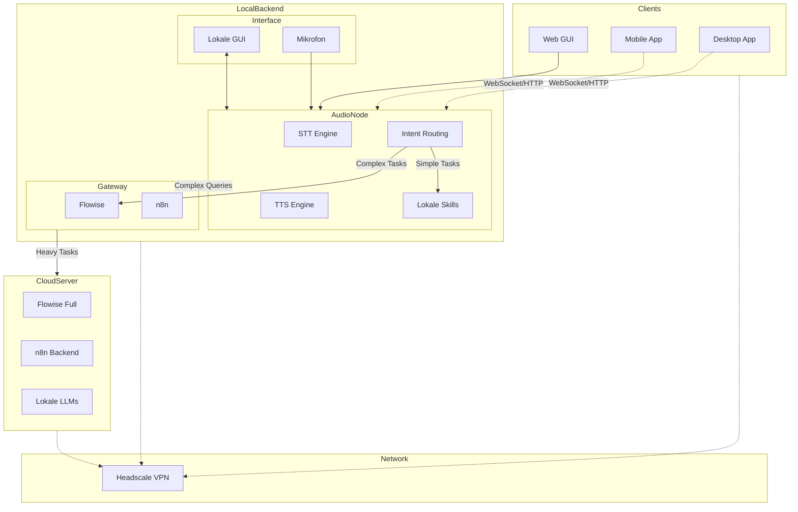

# 🤖 Modulares Sprachassistent-Ökosystem

Ein vollständiges, modulares Sprachassistenten-System bestehend aus lokalem Hardware-Backend (Raspberry Pi/Odroid) und Cross-Platform Client-Apps (Desktop/Mobile) mit moderner Web-GUI, KI-Integration und Automatisierung.


## 🏗️ Systemarchitektur

Das Ökosystem besteht aus zwei Hauptkomponenten, die nahtlos zusammenarbeiten:

### 🔧 Hardware-Backend (Lokales System)
Raspberry Pi/Odroid-basiertes Backend mit lokaler STT/TTS und KI-Integration

### 📱 Client-Apps (Cross-Platform)
Electron Desktop-App und Cordova Mobile-App für universellen Zugriff

<details>
<summary>Klicken zum Einblenden des Architekturdiagramms</summary>
  

</details>


## ✨ Features

### 🎯 Kernfunktionen
- **🎤 Lokale Spracheingabe** mit faster-whisper STT
- **🔊 Lokale Sprachausgabe** mit piper TTS  
- **🧠 Intelligentes Routing** zwischen lokalen Skills und Cloud-LLMs
- **🌊 Moderne animierte UI** mit konfigurierbaren Effekten
- **🔄 Automatisierung** mit n8n Workflows
- **🔐 Sichere Vernetzung** über Headscale VPN

### 🏠 Hardware-Backend Features
- **Lokale STT/TTS** ohne Cloud-Abhängigkeit
- **Modulare Architektur** auf mehreren Raspberry Pi/Odroid
- **FlowiseAI Integration** für LLM-Agent-Routing
- **n8n Workflows** für Home-Automation
- **Intent-basiertes Routing** (lokal vs. remote)
- **Wakeword-Erkennung** mit RaspOVOS

### 📱 Client-App Features

#### 🖥️ Desktop (Electron)
- **Native Menüs** und Keyboard-Shortcuts
- **System Tray Integration** für Background-Betrieb
- **Multi-Platform** (Windows, macOS, Linux)
- **Auto-Updates** mit electron-updater
- **Drag & Drop** Support

#### 📱 Mobile (Android/Cordova)
- **Touch-optimierte UI** mit Haptic Feedback
- **Background-Mode** für kontinuierliche Nutzung
- **Native Permissions** Management
- **Push-Benachrichtigungen**
- **PWA-Features** mit Service Worker

## 🛠 Technologie-Stack

### Hardware-Backend
- 🎤 **STT**: [Faster-Whisper](https://github.com/guillaumekln/faster-whisper) – lokale Speech-to-Text
- 🔊 **TTS**: [Piper TTS](https://github.com/rhasspy/piper) – Text-to-Speech auf ARM
- 🗣 **Voice OS**: [RaspOVOS](https://openvoiceos.github.io/raspOVOS/) – Wakeword-Erkennung
- 🧠 **LLM-Routing**: [FlowiseAI](https://github.com/FlowiseAI/Flowise) – No-Code Agent-Flows
- 🔁 **Automation**: [n8n](https://n8n.io/) – Workflow-Automatisierung
- 🔐 **Networking**: [Headscale](https://github.com/juanfont/headscale) – sicheres privates VPN

### Client-Apps
| Komponente | Desktop | Mobile | Web |
|------------|---------|--------|-----|
| **Framework** | Electron 28+ | Cordova 12+ | Modern Web APIs |
| **UI** | HTML5/CSS3/JS | HTML5/CSS3/JS | Responsive Design |
| **Audio** | Web Audio API | Cordova Media | MediaRecorder API |
| **Notifications** | Native | Cordova Plugins | Web Notifications |
| **Storage** | Electron Store | LocalStorage | IndexedDB |

## 📁 Projektstruktur

```
Sprachassistent/
├── 🏠 Hardware-Backend (Raspberry Pi System)
│   ├── config/                  # Gerät-spezifische Konfigurationen
│   │   ├── raspi4/             # STT/TTS Node Konfiguration
│   │   ├── raspi400/           # GUI Interface Konfiguration  
│   │   └── odroid/             # Gateway Konfiguration
│   ├── scripts/                # Setup & Wartungs-Skripte
│   │   ├── setup-headscale.sh
│   │   ├── install-piper.sh
│   │   ├── start-stt.sh
│   │   └── start-tts.sh
│   ├── gui/                    # Lokale Web-GUI
│   │   ├── index.html
│   │   ├── app.js
│   │   └── styles.css
│   └── docs/                   # Hardware-System Dokumentation
│
├── 📱 Client-Apps (Cross-Platform)
│   └── voice-assistant-apps/
│       ├── desktop/            # Electron Desktop App
│       │   ├── src/           # Haupt-App Code
│       │   ├── package.json
│       │   └── build/         # Build-Output
│       ├── mobile/            # Cordova Mobile App
│       │   ├── www/           # Web-Assets
│       │   ├── config.xml     # Cordova Konfiguration  
│       │   ├── hooks/         # Build-Hooks
│       │   └── platforms/     # Android/iOS
│       ├── shared/            # Gemeinsame Komponenten
│       │   ├── app.js         # Core-Logik
│       │   └── index.html     # Basis-Template
│       └── build_all.sh       # Cross-Platform Build-Script
│
└── 📚 Dokumentation & Setup
    ├── README.md              # Diese Datei
    ├── CONTRIBUTING.md        # Beitragen-Guidelines
    ├── LICENSE               # MIT Lizenz
    └── env.example          # Umgebungsvariablen-Template
```

## 🚀 Quick Start

### Voraussetzungen
```bash
# Für Hardware-Backend
- Raspberry Pi 4 (STT/TTS Node)
- Raspberry Pi 400 (GUI Interface) 
- Odroid N2 oder ähnlich (Gateway)
- Optional: Server für schwere LLM-Tasks

# Für Client-Apps
- Node.js 18+ & NPM 8+
- Android Studio (für Mobile)
- Git
```

### 1. 🏠 Hardware-Backend Setup

#### Raspberry Pi 4 (STT/TTS Node)
```bash
# STT Engine installieren
git clone https://github.com/guillaumekln/faster-whisper
cd faster-whisper && pip install .

# TTS Engine installieren  
sudo apt install piper

# Projekt klonen und konfigurieren
git clone https://github.com/161sam/Sprachassistent.git
cd Sprachassistent
cp env.example .env
# .env bearbeiten mit deinen Einstellungen

# STT/TTS Services starten
./scripts/start-stt.sh
./scripts/start-tts.sh
```

#### Raspberry Pi 400 (GUI Interface)
```bash
cd Sprachassistent/gui
python -m http.server 8080
# GUI unter http://localhost:8080 verfügbar
```

#### Odroid N2 (Gateway)
```bash
# Flowise installieren
git clone https://github.com/FlowiseAI/Flowise
cd Flowise && npm install && npm run build

# n8n installieren  
docker run -it --rm -p 5678:5678 n8nio/n8n

# Services starten
npm start  # Flowise
# n8n läuft bereits im Docker Container
```

#### Headscale Setup (Odroid & Clients)
```bash
# Auf jedem Gerät ausführen
./scripts/setup-headscale.sh
sudo headscale up --hostname raspi4-stt    # entsprechend anpassen
sudo headscale up --hostname raspi400-gui
sudo headscale up --hostname odroid-gateway
```

### 2. 📱 Client-Apps Setup

```bash
cd voice-assistant-apps

# Desktop App
cd desktop
npm install
npm run dev  # Development

# Mobile App  
cd ../mobile
npm install
npm install -g cordova
cordova platform add android
cordova run android

# Alle Apps bauen
../build_all.sh all release
```

## ⚙️ Konfiguration

### Intent-Routing konfigurieren

Das System routet Anfragen intelligent zwischen lokalen Skills und Remote-Services:

```json
// config/raspi4/routing-config.json
{
  "intents": {
    "weather": {
      "target": "n8n-workflow",
      "endpoint": "odroid-n2.headscale:5678/webhook/weather"
    },
    "ai_question": {
      "target": "flowise-agent", 
      "endpoint": "odroid-n2.headscale:3000/api/v1/prediction/agent-id"
    },
    "smart_home": {
      "target": "local-skill",
      "handler": "home_automation"
    },
    "calculation": {
      "target": "local-skill",
      "handler": "math_calculator"
    }
  }
}
```

### Client-App Verbindung konfigurieren

```javascript
// voice-assistant-apps/shared/app.js
const config = {
  // Hauptverbindung zum Raspberry Pi STT/TTS Node
  websocket: {
    url: 'ws://raspi4-stt.headscale:8123',
    fallback: 'ws://192.168.1.100:8123'
  },
  
  // Direkte Verbindung zu Flowise/n8n (optional)
  flowise: {
    url: 'http://odroid-gateway.headscale:3000'
  },
  
  n8n: {
    url: 'http://odroid-gateway.headscale:5678'  
  }
};
```

## 🧠 Intent-Routing Logik

| Intent-Beispiel | Ziel | Handler |
|----------------|------|---------|
| "Wie ist das Wetter?" | n8n Workflow | Wetter-API Call |
| "Was ist Künstliche Intelligenz?" | Flowise Agent | LLM (GPT/Claude/Llama) |
| "Mach das Licht an" | Local Skill | Home Assistant Integration |
| "Rechne 25 mal 17" | Local Skill | Math Calculator |
| "Spiele Musik ab" | Local Skill | MPD/Spotify Control |
| "Schreibe eine E-Mail" | Flowise Agent | LLM + SMTP Workflow |

## 🖥️ Usage Examples

### Hardware-Backend (Direct)
```bash
# Direkt mit Raspberry Pi GUI interagieren
# Web-Interface: http://raspi400-gui.headscale:8080

# Voice Command via Mikrofon
"Hey Assistant, wie ist das Wetter heute?"
# -> n8n Workflow -> OpenWeatherMap API -> TTS Response

# Text Input via GUI
"Erkläre mir Machine Learning"  
# -> Flowise Agent -> Local LLM -> Text Response
```

### Desktop App (Electron)
```bash
# Desktop App starten
cd voice-assistant-apps/desktop
npm run dev

# Features:
# - Native Desktop Integration
# - System Tray für Background-Betrieb  
# - Keyboard Shortcuts (Ctrl+Enter für Voice)
# - Auto-Updates
# - Multi-Monitor Support
```

### Mobile App (Android)
```bash
# Mobile App installieren
cd voice-assistant-apps/mobile
cordova run android --device

# Features:
# - Touch-optimierte UI
# - Haptic Feedback
# - Background-Mode
# - Push Notifications
# - Offline-Fähigkeiten
```

## 🧪 Testing & Debugging

### Hardware-Backend Testing
```bash
# STT Service testen
curl -X POST http://raspi4-stt.headscale:8123/stt \
  -H "Content-Type: application/json" \
  -d '{"audio": "base64_audio_data"}'

# TTS Service testen  
curl -X POST http://raspi4-stt.headscale:8123/tts \
  -H "Content-Type: application/json" \
  -d '{"text": "Hallo Welt", "voice": "de-thorsten"}'

# Intent Routing testen
curl -X POST http://raspi4-stt.headscale:8123/query \
  -H "Content-Type: application/json" \
  -d '{"text": "Wie ist das Wetter?", "session": "test"}'
```

### Client-Apps Testing
```bash
# Desktop App Tests
cd voice-assistant-apps/desktop
npm test
npm run e2e

# Mobile App Tests
cd voice-assistant-apps/mobile  
cordova run android --debug
# Chrome DevTools: chrome://inspect -> Remote Targets
```

## 📦 Deployment & Distribution

### Hardware-Backend Deployment
```bash
# Raspberry Pi Image erstellen
# 1. SD-Karte mit Raspberry Pi OS flashen
# 2. Setup-Skripte ausführen
./scripts/setup-complete-system.sh

# Docker Deployment (optional)
docker-compose -f docker-compose.hardware.yml up -d
```

### Client-Apps Distribution

#### Desktop Apps
```bash
cd voice-assistant-apps
./build_all.sh desktop release

# Outputs:
# - KI-Sprachassistent-2.1.0.exe (Windows)
# - KI-Sprachassistent-2.1.0.dmg (macOS)  
# - KI-Sprachassistent-2.1.0.AppImage (Linux)
```

#### Mobile Apps
```bash
./build_all.sh mobile release

# Outputs:
# - app-release.apk (Android)
# - Signed für Google Play Store
```

## 🔧 Entwicklung & Anpassung

### Neue Local Skills hinzufügen
```python
# skills/weather_skill.py
class WeatherSkill:
    def handle_intent(self, intent_data):
        location = intent_data.get('location', 'hier')
        weather = self.get_weather(location)
        return f"Das Wetter in {location} ist {weather}"
    
    def get_weather(self, location):
        # API Call zu OpenWeatherMap
        pass
```

### Flowise Agent erweitern
```json
// flowise-flows/assistant-agent.json
{
  "nodes": [
    {
      "id": "llm-node",
      "type": "ChatOpenAI",
      "data": {
        "model": "gpt-4",
        "temperature": 0.7
      }
    },
    {
      "id": "memory-node", 
      "type": "ConversationSummaryMemory"
    }
  ]
}
```

### n8n Workflow erstellen
```json
// n8n-workflows/smart-home-control.json
{
  "name": "Smart Home Control",
  "nodes": [
    {
      "name": "Webhook",
      "type": "n8n-nodes-base.webhook",
      "parameters": {
        "path": "smart-home"
      }
    },
    {
      "name": "Home Assistant",
      "type": "n8n-nodes-base.homeAssistant" 
    }
  ]
}
```

## 🤝 Contributing

Wir freuen uns über Beiträge zu beiden Teilen des Systems! Bitte lesen Sie unsere [Contributing Guidelines](CONTRIBUTING.md).

### Entwicklungsbereiche
- **🏠 Hardware-Backend:** Python Skills, STT/TTS Optimierung, Routing-Logik
- **📱 Client-Apps:** UI/UX Verbesserungen, neue Features, Cross-Platform Support  
- **🧠 KI-Integration:** Flowise Flows, n8n Workflows, LLM Optimierung
- **📚 Dokumentation:** Tutorials, Setup-Guides, Architecture Docs

### Development Workflow
1. **Fork** das Repository
2. **Branch** erstellen (`git checkout -b feature/amazing-feature`)
3. **Commit** Änderungen (`git commit -m 'Add amazing feature'`)
4. **Test** auf verschiedenen Komponenten
5. **Pull Request** öffnen

## 🐛 Troubleshooting

### Hardware-Backend Probleme
```bash
# STT Service funktioniert nicht
sudo systemctl status faster-whisper
journalctl -u faster-whisper -f

# TTS Audio-Ausgabe fehlt
alsamixer  # Audio-Level prüfen
aplay /usr/share/sounds/alsa/Front_Left.wav

# Headscale Verbindung
headscale ping raspi4-stt
headscale status
```

### Client-App Probleme
```bash
# Desktop Build-Fehler
cd voice-assistant-apps/desktop
rm -rf node_modules package-lock.json
npm install

# Mobile Build-Fehler  
cd voice-assistant-apps/mobile
cordova clean android
cordova platform rm android && cordova platform add android
```

### Netzwerk & Verbindung
```bash
# WebSocket-Verbindung testen
wscat -c ws://raspi4-stt.headscale:8123

# Firewall prüfen
sudo ufw status
sudo iptables -L

# DNS Resolution  
nslookup raspi4-stt.headscale
ping raspi4-stt.headscale
```

## 📊 Roadmap

### Version 2.2.0 (Q2 2025)
- [ ] iOS Mobile App Support
- [ ] Wake Word Training Interface
- [ ] Advanced Intent Classification (ML-based)
- [ ] Multi-Language STT/TTS Support
- [ ] Home Assistant Deep Integration

### Version 2.3.0 (Q3 2025)
- [ ] Edge AI Acceleration (Coral TPU Support)
- [ ] Custom Voice Cloning with Piper
- [ ] Advanced n8n Workflow Templates
- [ ] Distributed Load Balancing
- [ ] Advanced Analytics Dashboard

### Version 3.0.0 (Q4 2025)
- [ ] Complete Architecture Redesign
- [ ] Kubernetes Orchestration Support
- [ ] Advanced Multi-Agent Systems
- [ ] Real-time Voice Conversation Mode
- [ ] Integrated Video Understanding

## 🏆 Use Cases

### 🏠 Smart Home Hub
- Zentrale Steuerung aller Smart Home Geräte
- Sprachbasierte Automatisierung
- Lokale Verarbeitung ohne Cloud

### 🖥️ Desktop Productivity
- Meeting-Notizen per Spracheingabe
- E-Mail-Diktat und -Versand
- Kalender- und Task-Management

### 📱 Mobile Assistant  
- Unterwegs-Zugriff auf Home-System
- Location-based Automations
- Offline-Funktionalität

### 🏢 Business Integration
- CRM-Integration über n8n
- Workflow-Automatisierung
- Team-Produktivitäts-Tools

## 📄 Lizenz

Dieses Projekt ist unter der [MIT License](LICENSE) lizenziert.

## 🙏 Danksagungen

### Hardware-Backend
- **Faster-Whisper** Team für lokale STT-Engine
- **Piper TTS** Entwickler für ARM-optimierte TTS
- **RaspOVOS** Community für Wakeword-Integration
- **FlowiseAI** für No-Code LLM-Workflows
- **n8n** für offene Automatisierungsplattform
- **Headscale** für sichere Vernetzung

### Client-Apps  
- **Electron** Team für Desktop-Framework
- **Apache Cordova** für Mobile-Platform
- **Web Audio API** Implementierer
- **Open Source** Community

---

**🌟 Entwickelt mit ❤️ für die Voice Assistant & Maker Community**

**⭐ Star uns auf GitHub, wenn dieses Projekt hilfreich ist!**

---

## 🔗 Weiterführende Links

- 📚 **[Hardware Setup Guide](docs/hardware-setup.md)**
- 🏗️ **[Architecture Deep Dive](docs/architecture.md)**
- 🔧 **[Development Guide](docs/development.md)**
- 🤝 **[Contributing Guidelines](CONTRIBUTING.md)**
- 🐛 **[Issues & Support](https://github.com/your-repo/issues)**
- 💬 **[Discussions](https://github.com/your-repo/discussions)**
