# 🧠 Lokaler Sprachassistent mit Raspberry Pi, Odroid, Flowise, n8n & Tailscale

Ein leichtgewichtiges, modulares Sprachassistenten-System mit lokalen STT/TTS-Funktionen, GUI-Interface, Automatisierungsintegration und LLM-Routing – verteilt über mehrere Einplatinencomputer und einen leistungsstarken Server.

---

## ⚙️ Architekturüberblick

```mermaid
flowchart TB
  subgraph Interface [Raspi 400 – GUI Interface]
    Mic400 -->|Audio| Raspi4
    GUI400 --> Raspi4
    Raspi4 -->|Antwort| GUI400
  end

  subgraph AudioNode [Raspi 4 – STT/TTS Node]
    STT
    TTS
    IntentRouting
    Raspi4 --> STT
    Raspi4 --> TTS
    Raspi4 --> IntentRouting
    IntentRouting -->|lokal| Skills
    IntentRouting -->|remote| Odroid
  end

  subgraph Gateway [Odroid N2 – Flowise/n8n Light]
    Odroid --> Flowise
    Odroid --> n8n
    Flowise --> LLMs
    n8n --> Automationen
  end

  subgraph Server [Server – LLM & Automatisierung]
    ServerFlowise[Flowise]
    ServerN8n[n8n]
    ServerLLM[Lokale LLMs]
    ServerFlowise --> ServerLLM
    ServerN8n --> ServerFlowise
  end
```

<details>
<summary>Klicken zum Einblenden des Architekturdiagramms</summary>



</details>

---

## 🔩 Komponentenübersicht

| Gerät         | Rolle                            | Aufgaben                                               |
|---------------|----------------------------------|--------------------------------------------------------|
| 🖥️ **Raspi 400** | GUI-Interface + Eingabe         | Wakeword, Text-UI, Mikro, Weiterleitung                |
| 🔊 **Raspi 4**   | Audio-Node mit STT/TTS          | STT (faster-whisper), TTS (piper), Intent-Routing      |
| 📡 **Odroid N2** | Gateway + Mini-Automatisierung  | Flowise Agent Routing, n8n Workflow Trigger            |
| 🧠 **Server**    | zentrale KI & Automationen      | Flowise, lokale LLMs, n8n Backend                      |

---

## 🛠 Verwendete Technologien

- 🎤 [Faster-Whisper](https://github.com/guillaumekln/faster-whisper) – lokale Speech-to-Text Engine
- 🔊 [Piper TTS](https://github.com/rhasspy/piper) – Text-to-Speech auf ARM
- 🗣 [RaspOVOS](https://openvoiceos.github.io/raspOVOS/) – Sprachassistent mit Hotword-Support
- 🧠 [FlowiseAI](https://github.com/FlowiseAI/Flowise) – No-Code LLM-Agent-Routing
- 🔁 [n8n](https://n8n.io/) – Automatisierungsplattform mit Workflows
- 🔐 [Tailscale](https://tailscale.com) – privates VPN zur sicheren Verbindung aller Komponenten

---

## 🧭 Projektziele

✅ Sprachassistent mit lokaler STT/TTS-Funktion  
✅ GUI auf Raspi 400 mit Mikrofon und Tastatur  
✅ Komplexe Anfragen an Server (LLM / Automatisierung) weiterleiten  
✅ Modulares, ressourcenschonendes System ohne Cloudbindung  
✅ Absicherung und Fernzugriff über Tailscale VPN

---

## 🚀 Installation & Setup

### 1. 🔊 Raspi 4: STT/TTS & RaspOVOS
```bash
git clone https://github.com/guillaumekln/faster-whisper
cd faster-whisper && pip install .

sudo apt install piper
```

> Optional: RaspOVOS installieren und Wakeword aktivieren

---

### 2. 🖥️ Raspi 400: GUI-Interface
- Electron- oder Web-GUI starten
- Mikrofonaufnahme → an Raspi 4 senden (WebSocket, Pipe, etc.)
- Antwortanzeige aus Raspi 4 empfangen

---

### 3. 📡 Odroid N2: Gateway
```bash
# Flowise installieren
git clone https://github.com/FlowiseAI/Flowise
cd Flowise && npm install && npm run build && npm start

# n8n minimal mit Docker starten
docker run -it --rm -p 5678:5678 n8nio/n8n
```

---

### 4. 🔐 Tailscale auf allen Geräten installieren
```bash
curl -fsSL https://tailscale.com/install.sh | sh
sudo tailscale up --hostname odroid-n2
```

---

## 🧠 Routing-Logik (Intent → Ziel)

| Beispiel-Intent               | Ziel                    |
|------------------------------|-------------------------|
| „Wie ist das Wetter?“        | `n8n` Server-Workflow    |
| „Was ist KI?“                | `Flowise` → LLM Server   |
| „Mach das Licht an“          | lokales Skill (RaspOVOS) |
| „Rechne 12 mal 37“           | lokal (Raspi 4)          |

---

## 📚 Quellen & Inspiration

- 💬 https://github.com/ggml-org/whisper.cpp/discussions/166  
- 🧠 https://www.maibornwolff.de/know-how/openai-whisper-raspberry-pi/  
- 🧩 https://openvoiceos.github.io/raspOVOS/#models-and-skill-enhancements  
- 🧾 https://blog.graywind.org/posts/fasterwhisper-stt-server-script/  

---

## 📦 Lizenz

MIT – feel free to fork, adapt and build your own assistant!

---
