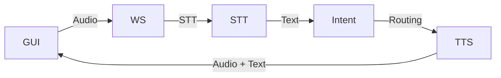

# 🏗 Architekturübersicht – Sprachassistent

Diese Datei beschreibt die Systemarchitektur des dezentralen Sprachassistenten, der auf Raspberry Pi, Odroid und einem zentralen Server basiert.

---

## 🎯 Ziel

Ein verteilter Sprachassistent, der lokal Sprache versteht (STT), antwortet (TTS) und komplexe Aufgaben an eine zentrale Automatisierungslogik weiterleitet (n8n, Flowise, lokale LLMs).

---

## 🧱 Komponenten

### 🔊 Raspi 4 (8 GB)

* **STT**: [`faster-whisper`](https://github.com/guillaumekln/faster-whisper)
* **TTS**: [`piper`](https://github.com/rhasspy/piper)
* **Intent-Routing**: ML-basierte Klassifikation mit Fallback
* **WebSocket-Server**: `ws_server_fastapi.py` (FastAPI-basierter Nachfolger)

### 🧰 Raspi 400 (4 GB)

* **GUI**: Electron-/Web-basierte Steuerung über integrierte Tastatur + Display
* **WebSocket-Client**: sendet Sprache an Raspi 4, empfängt Antwort (Text + Audio)

### 🧠 Odroid N2

* **Flowise (Docker/NPM)**: Agent-basierte LLM-Antwortlogik
* **n8n (Docker/NPM)**: Automatisierungslogik für Smart-Home, Skills etc.

### ☁️ Optionaler Server

* **lokale LLMs**: z. B. GGUF/OpenLLM/LLama.cpp
* **zentrale Flowise-/n8n-Instanzen**

---

## 🔀 Datenflüsse



Der typische Ablauf:

1. **GUI** zeichnet Audio auf und sendet es an den **WebSocket-Server (WS)**.
2. Der WS leitet den Strom an die **STT**-Komponente weiter.
3. Aus der Transkription erkennt die **Intent**-Logik den passenden Skill oder ruft externe Dienste (Flowise/n8n) auf.
4. Die Antwort wird mit **TTS** in Audio umgewandelt.
5. Audio und Text gehen zurück an die **GUI** und werden abgespielt/angezeigt.

---

## 🔐 Netzwerk & Sicherheit

* **Headscale VPN** verbindet alle Geräte sicher
* Token-Auth + IP-Filterung im WS-Server
* Optional: HTTPS mit lokalen Zertifikaten

---

## 🧩 Erweiterbarkeit

* Plugin-System für Skills
* Weitere GUIs (Mobile, Web)
* Mehrere STT/TTS-Knoten

---

## 📦 Projektstruktur (Auszug)

```
cli.sh
config/
docs/
scripts/
ws-server/
voice-assistant-apps/
```

### Standardprofile & `.env`

Profile werden mit `./config/setup_env.sh <profile>` aktiviert und erzeugen eine `.env` im Projektstamm. Wichtige Variablen:

| Variable | Beschreibung |
|----------|--------------|
| `TTS_ENGINE` | Standard TTS Engine (`piper`/`kokoro`) |
| `TTS_MODEL_DIR` | Verzeichnis der TTS-Modelle |
| `FLOWISE_URL` / `N8N_URL` | Endpunkte externer Dienste |

### Empfohlene Verzeichnisse

* `~/models/` – zentrale Modelle (Whisper, Piper, Kokoro)
* `~/.config/` – benutzerspezifische Einstellungen

*Pfadvariablen können in der `.env` überschrieben werden.*

---

## 📌 Nächste Schritte

* Skill-System dokumentieren (`docs/skill-system.md`)
* Netzwerk-Setup in `docs/headscale-setup.md`
* Routing-Logik in `docs/routing.md`

